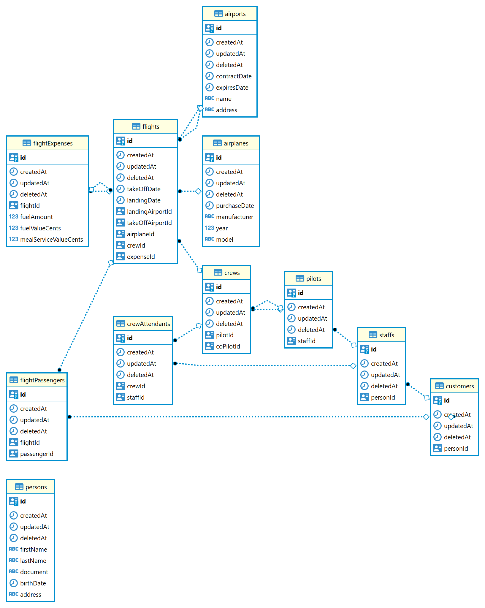

# Flight Manager
Code challenge of controlling flights

## Description
I'm not sure what to focus on this code challenge, so I choose focus on documentation, database structure and good patterns such as DDD, SOLID and clean architecture.

## Run using Docker
```
$ docker-compose up --build
``` 

## Documentation
Open the swagger page at http://localhost:3000/api

Before creating/updating flights you have to create some entities
- customers (passengers in the flight)
- staffs (staff members for the plane)
- pilots 
- airplanes
- airports

## Run locally
For running locally you have to provide a postgres uri connection in .env and crete a schema called 'flight-manager' 

``
$ npm install
``

``
$ npm run start
``

## DB diagram
In the database customers and staffs have a FK for persons. I don't know why it not shows in this diagram. Maybe it's bug on the export image tool

